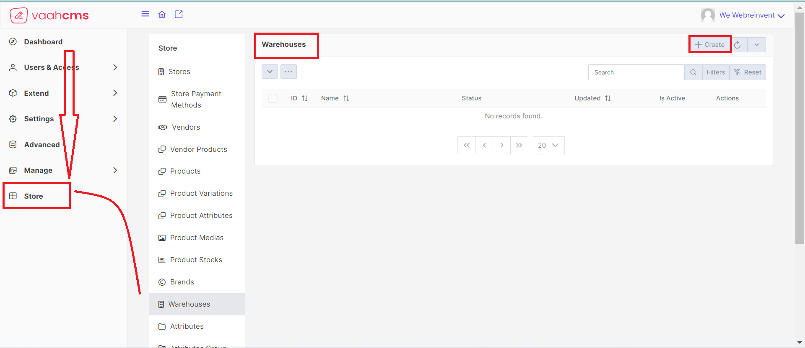

## What is Warehouse?

A warehouse is physical storage facility for keeping the products and inventory for the business.

## Purpose

The purpose of a `warehouse` is to provide a centralized location for the 
storage, management, and distribution of goods.

## Create
### How to create a Warehouse?
To create a `Warehouse`  in VaahStore, follow these steps:
- Login to the `VaahStore` admin panel.
- In the left sidebar section, click on Extend > Modules
- You will be able to see all the modules
- Activate `Store` module, by clicking on the `activate` button present in the right side of your screen.
- Click on `Store` from the left sidebar, You will be able to see the dashboard of the `Vaah Store` with links to all the
  `Cruds`
- Click on the `Warehouses` link in the dashboard section
- List page of `Warehouses` crud will be opened

Follow the below image for reference :

- 
- 
::image{imgSrc="/images/vaahstore/warehouses/create.png"}

### Requirement to create a Warehouse


| Fields                   |      | Descriptions                                      |
| ------------------------ | ---- | -------------------------------------------- |
| Name                     |      | `This will contain name of the warehouse.`    |
| Vendor                   |      | `Select the Active-vendor from the dropdown .By default it has the default vendor`         |
| Country                  |      | `Select the country from the dropdown.` |
| State                    |      | `This field will contain the name of the State.`         |
| City                     |      | `This field will contain the name of the City.`         |
| Address 1                |      | `This field is for the address line 1. It is optional field.`         |
| Address 2                |      | `This field is for the address line 2. It is optional field.`         |
| Pin Code                 |      | `This field will contain the postal code.`         |
| Status*                  |      | `Select the status of the warehouse.`         |
| Status Notes             |      | `Notes are to describe your decision for any status.`   |
| Is Active                |      | `This is to Activate or Deactivate your warehouse.`         |

Fill the fields with valid values and click  `Create & New` button present in the top right corner of your screen,
You will get the message `warehouse created successfully`

Various buttons and their usage in `Create warehouse` form

- `Create & Close` : It will create the warehouse and redirect you to the list page of `warehouses` crud
- `Create & Clone` : It will create the warehouse and clone all the details of the particular warehouse into a new form
- `Reset` : It will reset all the values prefilled by the user in every field of the form
- `Fill` : It will fill every field with the form with valid values

## Update
To update an existing warehouse, you need to click on `pencil` icon present under the `Actions` column on the list page
of `Warehouse` crud.

Follow the below image for reference:

A form will open to the right side of your screen with the prefilled values, you just need to update the values of the
field that you want to update.   
Follow the below image for reference:


Other options available in the `Update` window   
Follow the below image for reference:


- `Save & Close` : It will save the record and redirect you to the list page of `Warehouse` crud
- `Save & Clone` : It will save the record and clone all the details of that particular Warehouse and prefill all the values in a new form
- `Save & New`   : It will save the record and open a new form for you to add new `Warehouse`
- `Trash` : It will trash that particular `Warehouse` but give you the option to restore that `Warehouse` with a `restore` button
- `Delete` : It will ask for your confirmation before deleting that particular `Warehouse`
- `Fill` : It will fill all the fields with a valid value


## Trash
Meaning : When a `Warehouse` is moved to the Trash, it is not immediately deleted from the system. Instead, it is temporarily
stored in the Trash, allowing users to recover or restore the warehouse if needed. This provides a safety net in case the
`warehouse` was deleted accidentally or if the user wants to retrieve it at a later time.

Visit the list page of `warehouse`, here you will have the various options to trash a warehouse.

[comment]: <> (- Trash the `Warehouse` from selected menu list : just click on the `dropdown` menu present on the list page. You will have)

[comment]: <> (  various options to choose from.   )

[comment]: <> (  Follow the below image for reference:)

[comment]: <> (  )

[comment]: <> (  To trash the `Warehouse` from here you just need to select that particular warehouse and select the checkbox in front of the address that you want to trash)

[comment]: <> (  and choose the `Trash` option from the options available in the menu, you will get the message `action was successful`   )

[comment]: <> (  Follow the below image for reference:)

[comment]: <> (  )
##### Dropdown Menu:

- Select the desired Warehouse from the list.
- Click on the dropdown menu.
- Choose the Trash option.
- Receive the success message `action was successful`.
  

##### Bulk Menu:
- Click on the three dots on the list page.
- Select Trash All.
- Confirm the action in the popup.
- Receive the success message `action was successful`.

  
  

##### Action Column:
- Click on the trash icon in the Actions column.
- Receive the success message `action was successful`.
  

  

## Delete
Meaning : `Delete` refers to the action of removing a address from the system or marking it as inactive.
Deleting a Warehouse is useful when you no longer want use that `Warehouse` for customers.

There are various options to `Delete` a `Warehouse`

##### Dropdown Menu:

- Select the desired Warehouse from the list.
- Click on the dropdown menu.
- Choose the Delete option.
- Receive the success message `action was successful`.
  

##### Bulk Menu:
- Click on the three dots on the list page.
- Select Delete All.
- Confirm the action in the popup.
- Receive the success message `action was successful`.

  
  

##### Action Column:
- Click on the trash icon in the Actions column.
- Receive the success message `action was successful`.
  

  

## Restore
Meaning : The `Restore` option allows you to bring back a previously deleted or trashed `Warehouse` and make it active
again. This can be useful if you accidentally deleted a `Warehouse` or if you need to retrieve a `Warehouse` that was
temporarily removed from your store but still has relevant information or data associated with it.

Visit the list page of `Warehouse`, here you will have the various options to restore a warehouse.
##### Dropdown Menu:

- Select the desired Warehouse from the list.
- Click on the dropdown menu.
- Choose the Delete option.
- Receive the success message `action was successful`.
  

##### Bulk Menu:
- Click on the three dots on the list page.
- Select Delete All.
- Confirm the action in the popup.
- Receive the success message `action was successful`.

  
  


## View

Visit the list page of `Warehouses` CRUD, here you will have the option to view the details of a particular `Warehouse`
In the list page of `Warehouse` CRUD, under the `Actions Column`, click on the eye icon, a new page will open to the
right side of your screen.

Follow the below images for reference:


## Filters

Meaning : In the context of VaahStore, filters refer to the criteria or conditions used to narrow down the search
results or data displayed in a list or table. Filters allow users to specify specific attributes or values to retrieve
only the relevant information they are interested in.
###### Steps to apply filters:
Visit the list page of `Warehouse` CRUD, from the list page click on `filters` button available on the top right corner
of your screen. A new page will open with various filters section in it.

Follow the below images for reference:


##### Date:
- Choose a date range (from and to) in the Date filter.
- Records will be filtered based on the "created_at" column falling within the specified date range.

##### Country:
- Select the desired country from the dropdown.

##### Search By State/City/Postal Code
- Search in the input field about particula state, city or postal code to locate the worehouses acrding to this.


### API
---------
#### Create

##### URL
```php
POST <public-url>/public/api/store/warehouse
```

#### Request samples

```php
parameter = [
    "name",                             // String
    "slug",                             // String
    "vh_st_vendor_id",                  // Id
    "country",                          // String
    "state",                            // String
    "city",                             // String
    "address_1",                        // String
    "address_2",                        // String
    "postal_code",                      // String
    "taxonomy_id_warehouse_status",     // Id
    "status_notes",                     // String
    "is_default",                       // Boolean
    "is_active",                        // Boolean
    "taxonomy_id_brand_status",         // String
];
```
#### Response sample

```php
{
    "status": "success",
    "messages": [
        "Saved"
    ],
    "data": {
        ...........
        ...........
        ...........
    }
}
```

### Get List

#### URL
```php
GET <public-url>/public/api/store/warehouse?rows={number_of_rows}
```

#### Response sample

```php
{
    "success": true,
    "data": {
        ...........
        ...........
        ...........
    }
}
```

### Get Record

#### URL
```php
GET <public-url>/public/api/store/warehouse/{record_id}
```

#### Response sample

```php
{
    "success": true,
    "data": {
        ...........
        ...........
        ...........
    }
}
```

### Update

#### URL
```php
PUT <public-url>/public/api/store/warehouse/{id}
```

#### Request samples

```php
parameter = [
    ..........
    'same as create'
    ..........
];
```

#### Response sample

```php
{
    "status": true,
    "messages": [
        "Saved successfully."
    ],
    "data": {
        ...........
        ...........
        ...........
    }
}
```
